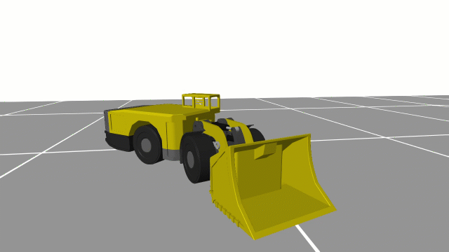
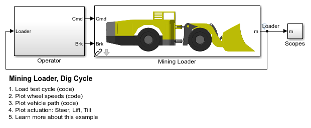
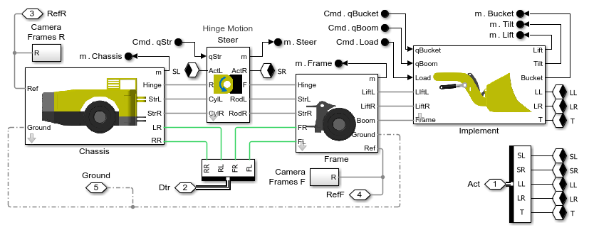
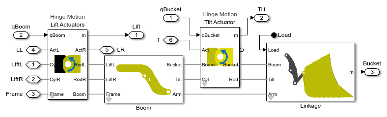

# **Mining Loader Design with Simscape**

This example models a mining loader with fully actuated steer, boom, 
and bucket tilt systems.  Both axles are powered.

* **Size actuators** using prescribed motion for cylinder positions. 
* **Tune control systems** using abstract actuation systems.
* **Explore kinematics** of bucket linkage.
* **Measure mechanical loads** with abstract models for fast simulation.
* **Evaluate braking distance** by sweeping test conditions.
* **Develop virtual braking sensors** by training surrogate models using generated data.

View on File Exchange:   
You can also open in MATLAB&reg; Online&trade;: 

Open the project file Mining_Loader_Simscape.prj to get started.

**Acknowledgements**: MathWorks would like to thank 
* M V Krishna Teja, PhD, [Virtual Proving Ground and Simulation Lab](https://prof-rkkumar.wixsite.com/iitm-vpg-lab), 
Raghupati Singhania Centre of Excellence at the Indian Institute of Technology, 
Madras for providing the tire parameters for this example.

## **Mining Loader Animation Clip**

## **Model of Mining Loader**

## **Mining Loader Subsystems**

## **Boom and Bucket Linkage Systems**

To learn more about modeling and simulation with Simscape, please visit:
* [Simscape Getting Started Resources](https://www.mathworks.com/solutions/physical-modeling/resources.html)
* Product Capabilities:
   * [Simscape&trade;](https://www.mathworks.com/products/simscape.html)
   * [Simscape Battery&trade;](https://www.mathworks.com/products/simscape-battery.html)
   * [Simscape Driveline&trade;](https://www.mathworks.com/products/simscape-driveline.html)
   * [Simscape Electrical&trade;](https://www.mathworks.com/products/simscape-electrical.html)
   * [Simscape Fluids&trade;](https://www.mathworks.com/products/simscape-fluids.html)
   * [Simscape Multibody&trade;](https://www.mathworks.com/products/simscape-multibody.html)

## License
The license is available in the LICENSE.md file in this GitHub repository.

## Community Support
[MATLAB Central](https://www.mathworks.com/matlabcentral)

Copyright 2026 The MathWorks, Inc.